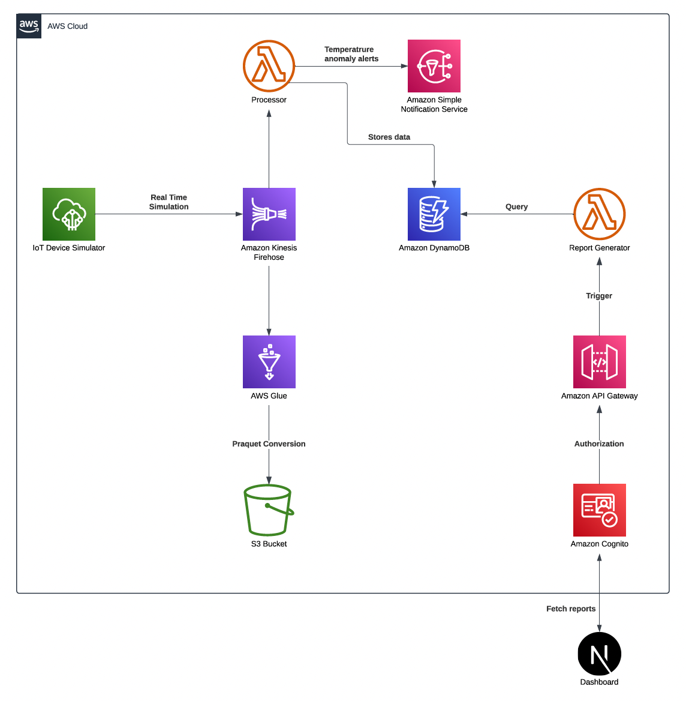

# IOT Device Stream ETL Analysis

## Overview

The **IOT Device Stream Analysis Service** is a cloud-based application designed to monitor, analyze, and report temperature data from IoT devices. This project leverages various Amazon Web Services (AWS) to create a scalable, secure, and efficient architecture that processes real-time data streams from simulated IoT sensors. The application performs anomaly detection and generates comprehensive summary reports, making it suitable for use cases such as industrial monitoring, smart homes, and healthcare environments.

## Project Objective

The primary objective of this project is to demonstrate a deep understanding of cloud architecting concepts by deploying a temperature analysis application on AWS. The project incorporates AWS Well-Architected Framework principles to ensure operational excellence, security, reliability, performance efficiency, and cost optimization.

## Architecture

The architecture of the IOT Device Stream Analysis Service is designed to handle real-time data processing and analysis. It utilizes the following components:

1. **IoT Device Simulator**: Simulates temperature data streams from virtual IoT devices.
2. **AWS IoT Core**: Routes simulated data to AWS Kinesis Firehose for further processing.
3. **Kinesis Data Firehose**: Streams data to AWS Lambda and AWS Glue for processing and transformation.
4. **AWS Lambda**: Processes data, detects anomalies, and triggers alerts via Amazon SNS.
5. **Amazon SNS**: Sends alerts to stakeholders in case of detected anomalies.
6. **Amazon DynamoDB**: Stores processed data for fast and scalable access.
7. **AWS Glue**: Maps data schema and converts data to Parquet format for efficient storage in Amazon S3.
8. **Amazon S3**: Stores raw and transformed data for long-term storage and analysis.
9. **AWS API Gateway**: Exposes report generation functionality as a REST API.
10. **Amazon Cognito**: Manages user authentication and authorization for secure API access.
11. **Vercel**: Hosts the frontend application built with Next.js, providing a user-friendly interface.

### Architecture Diagram

## Tech Stack

- **Frontend**: Next.js, hosted on Vercel
- **Backend**: AWS Lambda, AWS API Gateway
- **Database**: Amazon DynamoDB
- **Data Processing**: AWS Glue, AWS Lambda
- **Data Storage**: Amazon S3
- **IoT Simulation**: AWS IoT Core, IoT Device Simulator
- **User Management**: Amazon Cognito
- **Notification**: Amazon SNS

## AWS Services and Their Role

### IoT Device Simulator

- **Purpose**: Simulates real-time device data for testing and development.
- **Justification**: Provides realistic data streams, eliminating the need for physical devices.

### AWS IoT Core

- **Purpose**: Connects and manages IoT devices and data routing.
- **Justification**: Offers seamless integration with other AWS services for real-time data processing.

### Kinesis Data Firehose

- **Purpose**: Streams and processes data in real-time.
- **Justification**: Handles high-throughput data ingestion and supports data transformation and delivery to multiple destinations.

### AWS Lambda

- **Purpose**: Executes code for data processing and report generation.
- **Justification**: Provides a serverless environment that automatically scales, reducing operational overhead.

### Amazon DynamoDB

- **Purpose**: Stores processed temperature data for fast access.
- **Justification**: Offers low-latency data retrieval and scales automatically to handle varying loads.

### AWS Glue

- **Purpose**: Performs data transformation and schema mapping.
- **Justification**: Automates ETL processes and converts data into efficient storage formats.

### Amazon S3

- **Purpose**: Stores raw and transformed data for analysis.
- **Justification**: Provides scalable and durable storage with integration to other analytics services.

### AWS API Gateway

- **Purpose**: Exposes backend services as REST APIs.
- **Justification**: Manages API endpoints securely and efficiently, integrating with Cognito for user authentication.

### Amazon Cognito

- **Purpose**: Manages user authentication and authorization.
- **Justification**: Simplifies user management and provides secure access control.

### Amazon SNS

- **Purpose**: Sends alerts for detected anomalies.
- **Justification**: Provides flexible and reliable messaging and notification capabilities.

## Alignment with AWS Well-Architected Framework

### Operational Excellence

- **Monitoring**: Implemented using Amazon CloudWatch to track system performance and health.
- **Automation**: AWS Lambda automates data processing and report generation, reducing manual intervention.

### Security

- **Authentication**: Managed via Amazon Cognito, ensuring secure access to APIs.
- **IAM Policies**: Implemented least-privilege access for inter-service communications.

### Reliability

- **Serverless Architecture**: Leveraging AWS Lambda, DynamoDB, and S3 ensures high availability and fault tolerance.
- **Data Replication**: Data is replicated across multiple AZs for durability and availability.

### Performance Efficiency

- **Scalability**: Services like AWS Lambda and DynamoDB automatically scale based on demand.
- **Efficient Storage**: Data stored in Parquet format optimizes storage and query performance.

### Cost Optimization

- **Pay-as-You-Go**: Serverless computing minimizes costs by charging only for actual usage.
- **Lifecycle Policies**: S3 policies transition data to lower-cost storage classes as needed.

## Setup Instructions

### Prerequisites

- AWS account with appropriate permissions
- Node.js and npm installed locally
- AWS CLI configured with access to your AWS account

### Deployment Steps

1. **Deploy Frontend**:

   - Clone the repository: `git clone https://github.com/Hatim001/iot-stream-etl-analysis.git`
   - Navigate to the frontend directory: `cd iot-stream-etl-analysis/dashboard`
   - Install dependencies: `npm install`

2. **Deploy Backend**:

   - Use the AWS Management Console or AWS CLI to deploy Lambda functions, API Gateway, DynamoDB, and other resources.
   - Ensure all resources are correctly configured with IAM roles and policies.

3. **Configure IoT Simulation**:

   - Set up the IoT Device Simulator to generate and publish temperature data to AWS IoT Core.

4. **Set Up AWS Glue**:

   - Configure AWS Glue ETL jobs and crawlers to transform and catalog data.

5. **Verify Deployment**:

   - Access the application at `https://iot-etl-dashboard.vercel.app/`.
   - Test data simulation and verify report generation.

6. **Monitor and Optimize**:
   - Use CloudWatch for monitoring application performance and troubleshooting.

## Future Enhancements

- Integrate advanced analytics using Amazon Athena or Redshift.
- Implement machine learning models with AWS SageMaker for predictive analytics.
- Expand alerting mechanisms with AWS Pinpoint for SMS and push notifications.
- Continuously improve the frontend for a better user experience.
